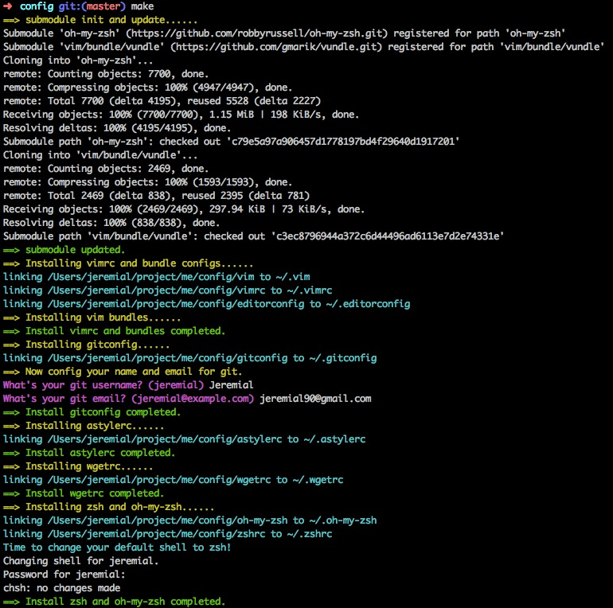

## What are in the repo
    dotfile
    ├── astylerc
    ├── gitconfig
    ├── sublime
    |   ├── monokai-custom
    |   ├── Preference.sublime-settings
    |   └── SublimePackages.md
    ├── vim
    |   ├── bundle
    │   │   └── vundle
    │   ├── editorconfig
    │   └── vimrc
    ├── wgetrc
    └── zsh
        ├── oh-my-zsh
        └── zshrc

## Why is the file or directory here

- astylerc - the config for **astyle** which is a format tool for *C*, *C++*, *C#*, *Java*. Also can used in VIM
- gitconfig - the config for **git**
- sublime - all things about _Sublime Text 2_
    - monokai-custom - git submodule, Monokai-custom colorscheme
    - Preference.sublime-settings - the Preference file
    - SublimePackages.md - the list of sublime packages I use
- vim - all things about _VIM_
    - bundle/vundle - the *vim bundle manager*
    - editorconfig - the config for vim bundle **js-beautify**
    - vimrc - the config for **vim**
- wgetrc - the `http_proxy` config for **wget**
- zsh - all things about *zsh*
    - oh-my-zsh - git submodule, the directory `.oh-my-zsh` for **zsh**
    - zshrc - the config for **zsh**, firstly generated by **[oh-my-zsh](https://github.com/robbyrussell/oh-my-zsh)**, and some other config added by me

## What vim bundles are included in vimrc

    Bundle 'gmarik/vundle'
    Bundle 'tomasr/molokai'
    Bundle 'scrooloose/nerdtree'
    Bundle 'jistr/vim-nerdtree-tabs'
    Bundle 'maksimr/vim-jsbeautify'
    Bundle 'einars/js-beautify'
    Bundle 'scrooloose/nerdcommenter'
    Bundle 'plasticboy/vim-markdown'
    Bundle 'kchmck/vim-coffee-script'
    Bundle 'groenewege/vim-less'
    Bundle 'mattn/emmet-vim'
    Bundle 'drmingdrmer/xptemplate'
    #Bundle 'mattn/calendar-vim'
    Bundle 'terryma/vim-multiple-cursors'
    Bundle 'airblade/vim-gitgutter'
    #Bundle 'vim-scripts/Align'
    Bundle 'kien/ctrlp.vim'

## Tasks & Requirement
If you want to do all tasks(except `sublime`) below, just run

    make

or do a specific task by run

    make <taskname1>[ <taskname2> <tasknameN> ...]

- ### Task `vimrc`
    1. Requirements: `git`, `vim`
    2. Setup:

            make vimrc

    *After* **or** *Before* above, you can override the system vim with the new one installed by `homebrew`.(OS X only. This is optional, but recommended, because system vim can't use system clipbord via register `+`)

        brew install macvim --override-system-vim
    And then uncomment the new vim `PATH` in `zsh/zshrc`.

- ### Task `gitconfig`
    1. Requirement: `git`
    2. Setup:

            make gitconfig

- ### Task `astylerc`
    1. Requirement: `astyle`. If you have installed `astyle` and press `Q` in vim, astyle will be used to format the *C*, *C++*, *C#*, *Java* file.
    2. Setup:

            make astylerc

- ### Task `wgetrc`
    1. Requirement: `wget`
    2. Setup:

            make wgetrc

- ### Task `zsh`
    If you have installed new zsh(located at `/usr/local/bin/zsh`) by `homebrew`, and want to use it as **login shell** instead of the **old** system zsh(`/bin/zsh`), you have to add `/usr/local/bin/zsh` to your `/etc/shells` to make it to be **standard shell**.

        sudo su
        echo "/usr/local/bin/zsh" >> /etc/shells
        exit
    And then **uncomment** the new zsh `PATH` in `zsh/zshrc`.

    Otherwise, the setup will use system zsh.
    1. Requirements: `git`, `zsh`
    2. Setup:

            make zsh

- ### Task `sublime`
    If you use `Sublime Text 2`, this task will add user Preference for it, and also add a [`Monokai-custom`](https://github.com/Jeremial/sublime-monokai-custom) colorscheme which supports Markdown file highlight.
    1. Requirement: `git`, `Sublime Text 2`
    2. Setup: **bakup your preference file first!**

        If you are using OS X, just run

            make sublime

        If you are using Linux, set `SUBLIMEPATH` before make, e.g.

            SUBLIMEPATH=~/sublimetext2 make sublime

        After installing the preference, maybe you want to reset `font_face` and `font_size` to what you prefer in `Preference.sublime-settings`.
    3. Install sublime packages(optional). You can see what sublime packages I used in [SublimePackages.md](sublime/SublimePackages.md).

    If you use `VIM Mode` in Sublime Text 2 on OS X 10.8+, when you hold `j`, `l`, `i`, `k`, the cursor will not move `left` `right` `up` `down` continually like real VIM, the solution is below.

    > \# Mac OS X Lion introduced a new, iOS-like context menu when you press and hold a key  
    > \# that enables you to choose a character from a menu of options. If you are on Lion  
    > \# try it by pressing and holding down 'e' in any app that uses the default NSTextField  
    > \# for input.

    > \# It's a nice feature and continues the blending of Mac OS X and iOS features. However,  
    > \# it's a nightmare to deal with in Sublime Text 2 if you're running Vintage (Vim) mode,  
    > \# as it means you cannot press and hold h/j/k/l to move through your file. You have  
    > \# to repeatedly press the keys to navigate.

    > \# You can disable this feature for just Sublime Text 2 by issuing the following command  
    > \# in your terminal:

    >       defaults write com.sublimetext.2 ApplePressAndHoldEnabled -bool false

    > \# Alternately, if you want this feature disabled globally, you can enter this:

    >       defaults write -g ApplePressAndHoldEnabled -bool false

    > \# In either case you'll need to restart your computer for the change to take place.

    > \# Happy coding!

## What are required optionally
*Note*: __These softwares or scripts are not necessary, but recommended.__

- astyle - required by **astylerc**

        # OS X only
        brew install astyle

- Kaleidoscope( _OS X only_ ) - an excellent difftool when input `git difftool`
- git-extras - some useful tools for git, install from <https://github.com/visionmedia/git-extras>( _Linux, OS X_ ) or

        # OS X only
        brew install git-extras

- git-flow - a post about git-flow: [a-successful-git-branching-model](http://nvie.com/posts/a-successful-git-branching-model/), install from <https://github.com/nvie/gitflow>( _Linux, OS X_ ) or

        # OS X only
        brew install git-flow

## LICENSE

The MIT License (MIT)

Copyright (c) 2013 Jeremial

Permission is hereby granted, free of charge, to any person obtaining a copy
of this software and associated documentation files (the "Software"), to deal
in the Software without restriction, including without limitation the rights
to use, copy, modify, merge, publish, distribute, sublicense, and/or sell
copies of the Software, and to permit persons to whom the Software is
furnished to do so, subject to the following conditions:

The above copyright notice and this permission notice shall be included in
all copies or substantial portions of the Software.

THE SOFTWARE IS PROVIDED "AS IS", WITHOUT WARRANTY OF ANY KIND, EXPRESS OR
IMPLIED, INCLUDING BUT NOT LIMITED TO THE WARRANTIES OF MERCHANTABILITY,
FITNESS FOR A PARTICULAR PURPOSE AND NONINFRINGEMENT. IN NO EVENT SHALL THE
AUTHORS OR COPYRIGHT HOLDERS BE LIABLE FOR ANY CLAIM, DAMAGES OR OTHER
LIABILITY, WHETHER IN AN ACTION OF CONTRACT, TORT OR OTHERWISE, ARISING FROM,
OUT OF OR IN CONNECTION WITH THE SOFTWARE OR THE USE OR OTHER DEALINGS IN
THE SOFTWARE.
